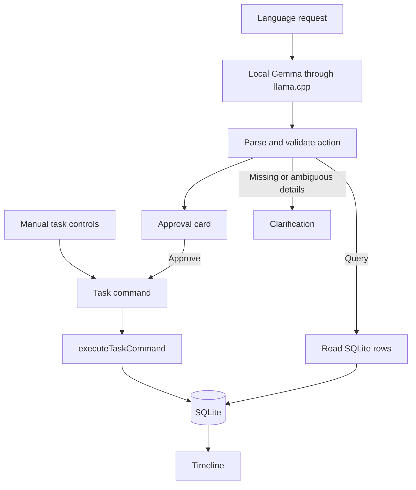

# Taskflow Local

**Your tasks, on your PC: an offline Windows timeline with local Gemma language controls and approval before every proposed change.**

Built for the [Hacktoberfest Weekend Challenge: Build for a Friend](https://dev.to/challenges/hacktoberfest-weekend-2026-10-01), October 2–5, 2026. Intended partner category: **Best Use of Gemma**. The challenge accepts local Gemma inference; this project uses it to operate real tasks rather than generate conversational answers.

## Why Taskflow Local exists

A friend saw my Taskflow web application and wanted the same idea on their own PC, with language controls to make it easier to use. Taskflow Local turns that request into a Windows desktop application: open a timeline, add or edit tasks directly, or type what you want to change.

The goal is practical accessibility through a second input method, without requiring an account, a hosted service, or a subscription. The timeline remains usable when the model is absent or unloaded. This is a new desktop implementation inspired by the earlier app's visual style; it does not reuse the earlier app's task-management components or business logic.

## What was built during the challenge window

The challenge runs from **October 2, 2026, 02:00 UTC** to **October 5, 2026, 06:59 UTC**. This snapshot documents work completed by **October 4, 2026**, before the deadline:

- A Windows Tauri application with a visible window, system tray, close-to-tray, Open/Quit, and single-instance restoration.
- A SQLite timeline with manual create/edit, status, read/unread, and soft delete.
- Local Gemma integration for create, query, update, delete, status, read/unread, and clarification.
- Strict action validation, approval cards, and one shared task-writing path.
- On-demand model startup, health checks, early-exit detection, restart retry, idle unloading, and shutdown cleanup.
- A production EXE and an NSIS installer containing the pinned llama.cpp runtime and DLLs.
- Unit tests, mocked browser checks, real-model contract tests, and project documentation.

The installed-build acceptance check is still outstanding. There was no prior Git history in the local project before its initial commit, so this is a snapshot of the challenge work, not a reconstructed day-by-day commit history.

## Key features

- **Time-ordered timeline:** past above NOW, future below; the next upcoming unfinished task gets a stronger rule.
- **Manual controls:** title, local date/time, optional duration, status, read/unread, and delete confirmation.
- **Language controls:** describe one action in ordinary words and review the resolved task and time.
- **Approval before language-driven writes:** Approve saves; Cancel discards.
- **Real query results:** answers are selected from SQLite, not invented by the model.
- **Local persistence:** tasks survive normal Quit and reopen; dates are stored in UTC and shown locally.
- **Desktop behavior:** closing the window hides it; the tray remains; opening again restores the existing window.
- **Model independence:** app startup does not load the model; manual task management works without it.

## Screenshots

These show the real React interface with **synthetic task data and mocked desktop/model IPC** from the browser tests. They are not evidence of an installed Windows tray or native model-lifecycle test.

### Timeline and manual controls


### Empty timeline


## Exactly how language commands work

1. Type a request into **Tell Taskflow something…** and select **Send**.
2. Rust starts the local runtime if needed. The UI shows **Starting…** while the model loads; health polling has a roughly 120-second startup deadline.
3. TypeScript builds the prompt from static rules and real-date examples, an en-US 14-day date table, up to 25 nearby tasks numbered `1..N`, and the current local time. UUIDs are not sent to the model.
4. Gemma returns **one JSON action**, constrained by a per-request schema. It receives no SQL, shell, filesystem tools, or tool loop.
5. Zod validates the action, required fields, reference bounds, and actual calendar dates. Invalid output gets one correction retry, then a plain-language error.
6. A mutation becomes an approval card showing the operation, task title, resolved date/time, and supplied duration. **No task-row write occurs before Approve.**
7. Approve calls `executeTaskCommand()`, the same function used by manual controls, then refreshes the timeline. For existing tasks, the UI rechecks whether the task changed after the proposal was made.
8. A query reads SQLite immediately and displays those rows, without an approval card.

| Operation | Example | Result |
| --- | --- | --- |
| Create | “Add gym tomorrow at 7 AM for one hour.” | A create proposal with a concrete date/time and 60-minute duration |
| Query | “What do I have tonight?” | SQLite tasks in the resolved time range |
| Update | “Move gym to tomorrow at 9 AM.” | An update proposal; unspecified fields stay unchanged |
| Delete | “Delete gym.” | A delete proposal; approval soft-deletes the task |
| Status | “Mark gym as done.” | A status proposal; supported states are todo, in progress, and done |
| Read/unread | “Mark the report unread.” | A read-state proposal, separate from completion |
| Clarify | “Add gym.” | “When?” because every task needs a scheduled time |

Supported queries are **range, open, unread, done, and next**. “Open” means unfinished; “next” selects the next future unfinished task. Range ends are exclusive.

If references are ambiguous, the app asks which task and offers dated task buttons instead of accepting a guessed mutation. Missing details can be answered in the same composer. Requests are serialized and Send is disabled while one is running. Review every proposal: schema validity does not guarantee that a language model understood your intent.

## Basic usage

Manual: select **+ New task**, enter a title and time, then save. Use each row's controls to edit, change status, mark read/unread, or delete.

English examples:

- “Add reading tomorrow at 8 PM for 30 minutes.”
- “Show my unread tasks.”
- “Move reading to tomorrow at 9 PM.”
- “Mark reading as done.”
- “Delete reading.”

Tamil example to try:

> நாளை காலை 9 மணிக்கு அம்மாவை அழைக்க வேண்டும் என்ற பணியைச் சேர்.

Meaning: add a task to call Amma tomorrow at 9 AM. Titles are kept in the user's language. **This non-English request has not been verified against the real model**; the five recorded model checks were in English. Check the proposed title and time before approving.

## Local, offline, and privacy behavior

After installing the app, runtime, and model, normal task operations and language requests work without an internet connection.

- No application account, cloud sync, telemetry, or remote model API.
- SQLite task data remains in the Windows user's application directory.
- Model requests go only to `127.0.0.1:39281`; the server binds to loopback and uses a per-session API key.
- Production code does not log task text or prompts; the runtime's output is suppressed.
- Chat and pending proposals exist only in React memory and are discarded on restart.
- Initial downloads, source dependency installation, and any WebView2 installation require internet access.
- Local does **not** mean encrypted: the SQLite database and model files are ordinary files protected by Windows permissions, not an app-level password or encrypted vault.

## Gemma and llama.cpp

The text-only V1 uses Google's **Gemma 4 E2B instruction-tuned QAT Q4_0 GGUF** checkpoint through a pinned Windows CPU build of **llama.cpp**. No multimodal projector is required.

| Item | Pinned value |
| --- | --- |
| Model repository | [google/gemma-4-E2B-it-qat-q4_0-gguf](https://huggingface.co/google/gemma-4-E2B-it-qat-q4_0-gguf/tree/675cff42a74c774d6cb76f76d8eacb49b48c9b93) |
| Model revision | `675cff42a74c774d6cb76f76d8eacb49b48c9b93` |
| Expected filename | `gemma-4-E2B_q4_0-it.gguf` |
| Model size | 3,349,516,256 bytes, about 3.35 GB |
| Model SHA-256 | `fa401b55b07ee70a54c6dae3903c783a6e65064312529ea57175cb5f8dec6634` |
| Runtime | llama.cpp `b11146`, `0.5.0-dev`, commit `7fe450e19` |
| Runtime archive | [llama-b11146-bin-win-cpu-x64.zip](https://github.com/ggml-org/llama.cpp/releases/download/b11146/llama-b11146-bin-win-cpu-x64.zip) |
| Runtime archive SHA-256 | `14cf1303ca9ac3abd94816850532f9f9a69ac66fbaca3776fc6f9061c2fac1d1` |

The code's source of truth for these pins is [modelConfig.ts](src/model/modelConfig.ts).

Runtime arguments include `--host 127.0.0.1 --ctx-size 4096 --parallel 1 --jinja`. Every completion uses `temperature: 0`, `max_tokens: 256`, and `chat_template_kwargs: { enable_thinking: false }`.

For this exact build, schema enforcement was verified with the nested form:

```json
{
  "response_format": {
    "type": "json_schema",
    "json_schema": {
      "name": "taskflow_action",
      "strict": true,
      "schema": {}
    }
  }
}
```

The empty schema above illustrates the envelope only; the actual request supplies the generated action schema. A schema-enforcement canary and five synthetic prompts passed, including full 25-task context. See [the recorded results](docs/verification/phase0-results.json) and [test script](tests/phase0-smoke.mjs). Do not silently upgrade either pin.

### Why local, open inference matters

A closed hosted API would require sending task context off the PC, maintaining internet access, and depending on a provider's service and pricing. Gemma's available weights and llama.cpp's open-source runtime let the language feature run on the same computer as the tasks, without a paid inference API or provider account.

The runtime can be inspected, rebuilt, and pinned alongside the application. That does not make the model infallible or free of hardware costs: CPU inference uses local memory and processing time, and this V1 has no validated minimum RAM or speed guarantee. “OpenAI-compatible” describes the local HTTP protocol; it does not mean the app calls OpenAI.

## Installation requirements and EXE usage

**For an end user:** a Windows x64 PC and Microsoft Edge WebView2. The CPU runtime is bundled; a GPU, Node, Rust, Python, Ollama, and API keys are not required to use an installed app.

Allow disk space for the app and the approximately 3.35 GB model, plus working space for downloads. The runtime/model were checked on the development machine, not across a hardware compatibility matrix.

The generated installer is:

```text
src-tauri/target/release/bundle/nsis/Taskflow Local_0.1.0_x64-setup.exe
```

It was built successfully but is **not committed to Git or published as a release asset in this snapshot**. Obtain it from the author or build it from source.

1. Run the installer and finish setup.
2. Launch **Taskflow Local** from the Start menu.
3. Add a task manually; no model is needed for this.
4. Install the model as described below to enable language commands.
5. Closing the window keeps the app in the tray. Windows may place the icon inside the **^** overflow menu.
6. Left-click the tray icon or choose **Open** to restore the window. Right-click and choose **Quit** to stop the app and model completely.

The build is unsigned. Windows may show SmartScreen; for a build you trust from this project, select **More info → Run anyway**.

The direct release EXE is `src-tauri/target/release/taskflow-local.exe`. Keep the matching `runtime/llama/` directory beside it; moving only the EXE breaks language runtime discovery. The installer supplies that layout automatically.

## Model-file placement

The installer contains the runtime, all its DLLs, and runtime license notices. **It does not contain or automatically download the model.**

1. Download [the pinned GGUF file](https://huggingface.co/google/gemma-4-E2B-it-qat-q4_0-gguf/resolve/675cff42a74c774d6cb76f76d8eacb49b48c9b93/gemma-4-E2B_q4_0-it.gguf).
2. In the app, choose **Open Models Folder** when “Local model not found” appears.
3. Place the file there with this exact name: `gemma-4-E2B_q4_0-it.gguf`.
4. Select **Check for model**, then send a request. Restarting the app is not required.

The Windows path is:

```text
%LOCALAPPDATA%\com.taskflow.local\models\gemma-4-E2B_q4_0-it.gguf
```

Verify the downloaded file in PowerShell:

```powershell
Get-FileHash -Algorithm SHA256 -LiteralPath "$env:LOCALAPPDATA\com.taskflow.local\models\gemma-4-E2B_q4_0-it.gguf"
```

Compare the result with the pinned hash above. The app currently checks file presence, not the hash at every startup. The development copy was hash-verified and downloaded anonymously; a literal private-browser-window download was not separately checked.

## Build and run from source

Development requires Git, **Node 24** with npm (verified with 24.20.0), a Rust MSVC toolchain, Windows C++ build tools, and WebView2. See [Tauri's Windows prerequisites](https://v2.tauri.app/start/prerequisites/). Runtime and model binaries are intentionally ignored by Git.

```powershell
git clone https://github.com/S-Srinivasan-06/hacktoberfest-weekend-2026-10-01.git
cd hacktoberfest-weekend-2026-10-01
npm ci
```

Prepare the pinned runtime before a native build:

1. Download the runtime ZIP linked above and verify its SHA-256 with `Get-FileHash`.
2. Extract it. Copy `llama-server.exe` and **every DLL from that build** into `src-tauri/runtime/llama/`.
3. Rename `llama-server.exe` to `taskflow-llama.exe`.
4. Preserve `LICENSE-LLVM-OpenMP` from the archive and include the [pinned llama.cpp MIT license](https://github.com/ggml-org/llama.cpp/blob/b11146/LICENSE) as `LICENSE.llama.cpp`.
5. Place the model in the per-user folder described above. It stays outside the repository and installer.

Run the desktop app:

```powershell
npm run tauri dev
```

Build the Windows NSIS installer:

```powershell
npm run tauri build
```

Check the code:

```powershell
npm run typecheck
npm test
cargo check --locked --manifest-path src-tauri/Cargo.toml
```

For browser checks, run `npm run dev`, then `npm run test:ui` in a second terminal. The runner uses an existing Chrome or Edge installation and mocked Tauri IPC. `npm run build` builds only the frontend; real persistent storage requires the desktop app.

## Persistence and restart behavior

SQLite is the source of truth. One `tasks` table stores UUID, title, UTC scheduled time, optional duration, status, read state, and creation/update/deletion timestamps. Delete sets `deleted_at_utc`; normal reads exclude deleted rows.

The database is `taskflow-local.db` in Tauri's per-user application config directory, normally `%APPDATA%\com.taskflow.local\`. The model is under `%LOCALAPPDATA%` separately. The app does not use browser localStorage for tasks.

Normal Quit and reopen reload saved tasks. React chat, pending approvals, and clarification state do not persist. Closing only the window keeps the same process alive.

The model starts on demand, unloads after **30 minutes idle in production / 60 seconds in development**, and can be unloaded manually. Startup removes stale processes named `taskflow-llama.exe` after single-instance registration; it does not target unrelated `llama-server.exe` processes.

## Architecture and tech stack

**React + TypeScript + Vite** own the UI and most logic. **Tauri 2 + thin Rust** own native window/tray and process management. **@tauri-apps/plugin-sql + SQLite** persist tasks. **Zod** validates model output. **Gemma + llama.cpp** interpret language locally.



`interpretUserRequest()` never mutates tasks. `taskRepository.ts` only reads. Every manual or approved mutation passes through `src/domain/taskService.ts`; schema initialization is the only other database-writing code and changes no task rows.

## Project structure

```text
src/
  app/                    Main screen and database bootstrap
  components/
    timeline/             Ordered tasks and NOW marker
    task/                 Manual editor
    composer/             Requests, approvals, queries, clarification
  db/                     SQLite adapter/schema and read-only repository
  domain/                 Task types, commands, dates, write service
  model/                  Pins, schemas, prompt/context, client/service, desktop transport
  state/                  React task state and command coordination
  styles/                 Design tokens and global styles
src-tauri/
  src/lib.rs              Tray, window behavior, single instance
  src/model_process.rs    Runtime startup, stop, idle timer, stale cleanup
  runtime/llama/          External runtime files; ignored by Git
  tauri.conf.json         Window, CSP, resources, NSIS packaging
tests/                    Unit tests, browser fixtures, model smoke test
docs/                     Synthetic screenshots and model-test evidence
```

## Checks and known limitations

**Passed on the development machine:** TypeScript typecheck, 26 unit tests, Rust checks and release compilation, three mocked browser scenarios, strict schema enforcement, five real-model prompts, and NSIS packaging.

Unit tests cover dates, reference validation, ambiguity, retry/locking, one write path, queries, and reopening a real SQLite file. Browser tests cover manual controls and confirm that a model proposal writes nothing before Approve. The installer script includes the runtime EXE, DLLs, and licenses and excludes the GGUF model.

**Not verified:** installation on a clean Windows account; actual tray interaction; native persistence through the installed UI; model requests, idle restart, and Quit cleanup through that UI. An installer build is not an installed-build acceptance test.

Other limits:

- Windows x64 only; unsigned installer.
- One action per request; at most 25 nearby tasks in the model context.
- Supported query kinds are fixed; no arbitrary SQL or general-purpose assistant.
- Language interpretation can be wrong even when valid JSON is returned.
- Non-English inference and screen-reader/accessibility compliance have not been validated.
- CPU resource use depends on the machine; no minimum RAM or performance promise.
- File download and hash verification are manual; no automatic model repair.
- Idle unloading happens natively; the UI may still say Ready until it next checks the process.
- Soft deletion has no restore UI; no automatic backups.

## Deliberately cut from V1

To keep the challenge focused: reminders/notifications, automatic model download, undo/event log, recurrence, projects/labels/kanban, bulk edits, attachments, voice, cloud sync/accounts, Windows Calendar integration, launch at login, global shortcuts, model picker, and persisted chat. The reserved reminder column does not implement reminders.

## Future work

First finish the installed Windows acceptance pass and gather feedback from the person using it. Then improve keyboard/screen-reader usability and test non-English commands. If useful, add a streaming model downloader with SHA-256 validation and simple reminders. These are plans, not shipped features.

## Attribution and licenses

- **Original project code:** no license has been granted yet. Public source availability alone does not grant reuse rights. No MIT or Apache license is being assigned to Taskflow Local in this snapshot.
- **Design inspiration:** the author's earlier Taskflow web application. Only literal visual values—colors, font choices, border, radius, and shadow offsets—were carried into `src/styles/tokens.css`; earlier components/business logic were not copied.
- **Model:** Google's pinned Gemma GGUF [model card](https://huggingface.co/google/gemma-4-E2B-it-qat-q4_0-gguf/blob/675cff42a74c774d6cb76f76d8eacb49b48c9b93/README.md) declares **Apache-2.0**. The weights are a separate upstream artifact and are not licensed by this repository.
- **Runtime:** [llama.cpp b11146](https://github.com/ggml-org/llama.cpp/tree/b11146), **MIT**. Bundled LLVM/OpenMP notices use **Apache-2.0 with LLVM exceptions** and are preserved in the package.
- **Libraries:** React/React DOM, Vite, and Zod (MIT); TypeScript (Apache-2.0); Tauri and its plugins (MIT OR Apache-2.0); SQLite (public domain). Upstream and transitive dependency notices continue to apply.
- **Development assistance:** implementation and checks were assisted by OpenAI Codex. The application's inference runs locally with Gemma, independently of that development tooling.
- No third-party task text or original Taskflow implementation is included in the screenshots; their data comes from synthetic test fixtures.

## Post-deadline change disclosure — updated October 4, 2026 (UTC)

**Deadline: October 5, 2026, 06:59 UTC.** The [DEV challenge rules](https://dev.to/challenges/hacktoberfest-weekend-2026-10-01) require commits after the submission deadline to be noted in the README.

**As of October 4, 2026 (UTC), there are no post-deadline commits or changes: the deadline has not occurred.** The initial source snapshot, README, synthetic screenshots, and recorded test evidence are being prepared before the cutoff.

| UTC date/time | Commit/change | Scope and effect |
| --- | --- | --- |
| None as of 2026-10-04 UTC | No post-deadline changes | Pre-deadline snapshot |

For every later post-deadline commit or uncommitted change, append its actual UTC date/time, commit hash when available, files/features affected, and whether it changes functionality, packaging, documentation, or demo assets. Keep this section even for README-only or demo-only updates. Do not backdate commits or describe later work as part of the deadline build.
