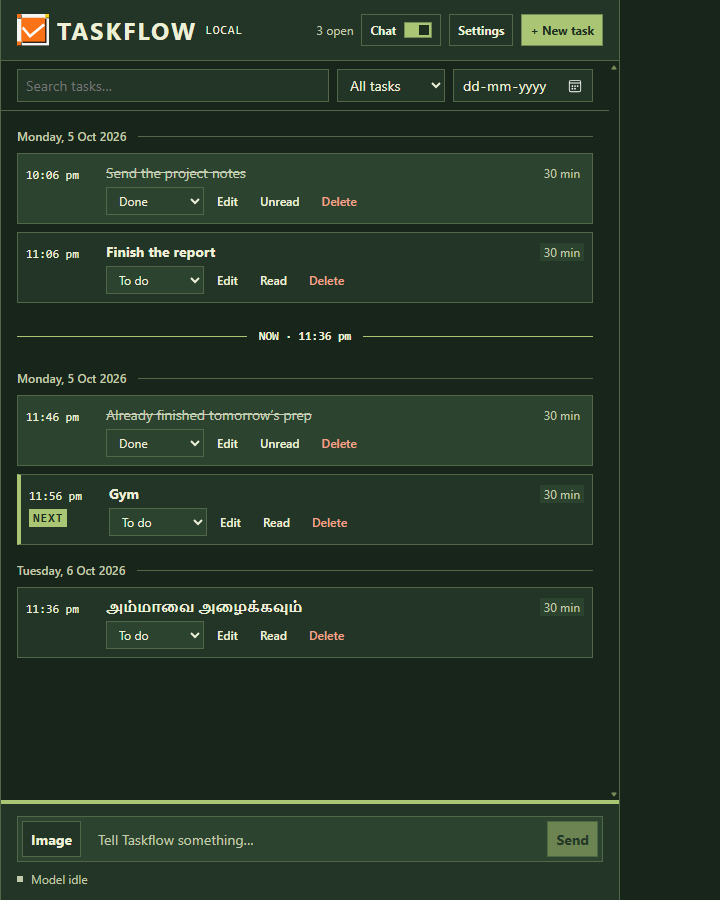
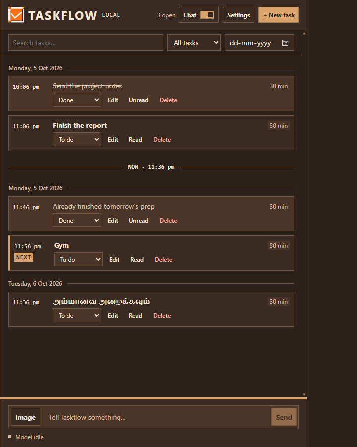
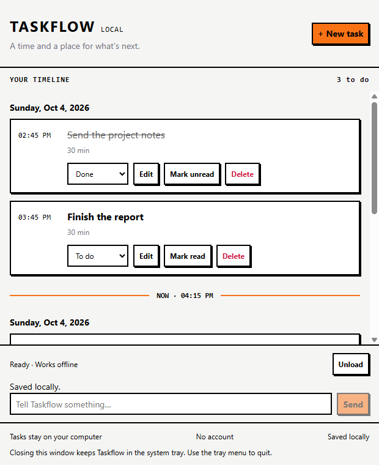
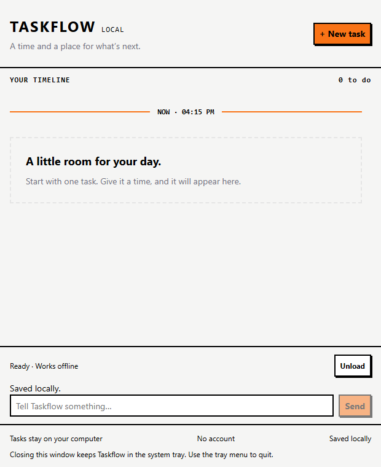

# Taskflow Local

**An offline Windows task manager with desktop reminders and local language controls.**

Add tasks directly, or describe a change and approve it before it is saved. Built for a friend who wanted the familiar Taskflow web experience on their own PC, with an easier way to enter and manage tasks.

**[Download the Windows installer](https://github.com/S-Srinivasan-06/Taskflow-Local-hacktoberfest-weekend/releases/download/desktop-update-2026-10-05/Taskflow-Local-2026-10-05-windows-x64-setup.exe)** · [All releases](https://github.com/S-Srinivasan-06/Taskflow-Local-hacktoberfest-weekend/releases) · [Portable ZIP](https://github.com/S-Srinivasan-06/Taskflow-Local-hacktoberfest-weekend/releases/download/desktop-update-2026-10-05/Taskflow-Local-2026-10-05-windows-x64-portable.zip)

The latest executable is the **October 5 desktop update**. Its version metadata is `0.1.0`; its dated release tag identifies the newer build. It includes post-deadline features, disclosed [below](#post-deadline-changes-utc). Model weights are downloaded separately. Manual tasks and reminders work without a model.

| Looking for… | Start here |
| --- | --- |
| Installation, models, reminders or troubleshooting | [User guide](docs/usage.md) |
| Source setup, architecture or model contract | [Developer guide](docs/development.md) |
| Challenge story, build process or attribution | [Challenge notes](docs/challenge.md) |
| Binary hashes and verification evidence | [October 5 release record](docs/verification/release-2026-10-05.json) |

## Get started

1. Download **`Taskflow-Local-2026-10-05-windows-x64-setup.exe`** from **Releases → Assets** and run it.
2. Open **Taskflow Local** from the Windows Start menu.
3. Select **+ New task**, enter a title and time, and save.
4. Set a desktop reminder in the editor. Choose a preset or **Custom date and time**.
5. Closing the window leaves the app in the system tray. **Tray → Open** restores it; **Tray → Quit** exits it.

Requires **Windows x64 and Microsoft Edge WebView2**. The installed app does not need Node, Rust, Python, a GPU or an API key. The installer is unsigned, so Windows may show SmartScreen. Use the installer for Windows notification support; the portable ZIP needs its complete `runtime/llama/` folder beside the executable.

Tasks survive restart. Reminders require Taskflow to remain running, including in the tray. Use **Settings → Test notification** and check Windows notification settings/Do Not Disturb if no banner appears. Actual banner delivery still needs visual confirmation.

## What it does

- **A compact timeline:** past tasks above NOW, upcoming tasks below, with the next unfinished task marked.
- **Manual task controls:** create, edit, complete/reopen, mark read/unread, and soft delete. Search by title and filter by date or status.
- **Desktop reminders:** at task time, 5/15/30/60 minutes before, or a custom date/time. New reminders must be in the future and at or before the task time. Rescheduling retains their lead time unless you edit the reminder too.
- **Optional chat:** a saved on/off switch hides or shows the request box. Off unloads a loaded model and discards unsaved chat state; manual controls and reminders remain available.
- **Language and screenshot input:** use downloaded local models; paste a PNG/JPEG with **Ctrl+V** or select **Image**, then review one proposed task.
- **11 themes:** Classic, Slate, Nord, Dracula, Solarized, Cyberpunk, Dark Grey, Full Black, Forest, Bubblegum and Autumn. Forest and Autumn use dark palettes; Settings shows previews and remembers your choice.

Keyboard shortcuts outside text fields: **N/C** for a new task, **/** for search, and **Esc** to close an editor/settings or clear filters.

## Screenshots and walkthrough



This is the real React interface with **synthetic tasks and mocked desktop/model calls**. It is a design preview, not proof of native tray or notification behavior.

<details>
<summary>More screenshots</summary>







</details>

Try this demo after model setup:

1. Create **Read a chapter** for tomorrow at 8 PM manually, with a reminder.
2. Type **“Move Read a chapter to tomorrow at 9 PM.”** Inspect the exact date/time, then **Approve** or **Cancel**.
3. Ask **“What do I have tomorrow?”** The answer contains saved SQLite rows.
4. Try **“Mark Read a chapter unread”**, then **“Mark Read a chapter as done.”** Approve each change.
5. Paste an appointment screenshot, request a task, and inspect the proposal before saving.
6. Close to the tray, reopen, then Quit and relaunch to inspect saved tasks.

A [recorded real Gemma image check](docs/verification/vision-results.json) interpreted [one synthetic dentist appointment](docs/screenshots/vision-input.png) as October 5, 2026, 10 AM IST, lasting 45 minutes. That verifies this example, not every screenshot.

## How language commands work

The model receives the request and a bounded list of nearby tasks. It returns **one schema-constrained JSON action**. The app validates the action, task reference and date; invalid output gets one correction attempt. Ambiguous references ask you to choose a task, and a create without a time asks **“When?”**

| Operation | Example | What happens |
| --- | --- | --- |
| Create | “Add reading tomorrow at 8 PM for 30 minutes.” | Review a create proposal, then approve |
| Query | “Show my unread tasks.” | Read matching SQLite rows; no approval |
| Update | “Move reading to tomorrow at 9 PM.” | Review the resolved change, then approve |
| Delete | “Delete reading.” | Approve a soft delete |
| Status | “Mark reading as done.” | Approve todo/in-progress/done changes |
| Read/unread | “Mark the report unread.” | Approve a read-state change, separate from completion |

**Nothing the model proposes changes a task until you approve it.** Approval uses the same `executeTaskCommand()` write service as manual controls. Queries come from SQLite, not model-written answers. Supported queries are range, open, unread, done and next; requests run one at a time.

Tamil example to try:

> நாளை காலை 9 மணிக்கு அம்மாவை அழைக்க வேண்டும் என்ற பணியைச் சேர்.

Meaning: add a task to call Amma tomorrow at 9 AM. Titles stay in the user's language. This non-English request has not been verified against the real model; check the proposed title and time. The [developer guide](docs/development.md#exactly-how-language-commands-work) includes a full request-to-storage example.

## Model-file placement

Chat is optional. For the tested Gemma setup:

1. Download [the text model](https://huggingface.co/google/gemma-4-E2B-it-qat-q4_0-gguf/resolve/675cff42a74c774d6cb76f76d8eacb49b48c9b93/gemma-4-E2B_q4_0-it.gguf), approximately **3.35 GB**.
2. Expand **Settings → Local model → Open Models Folder**, and copy it there as **`gemma-4-E2B_q4_0-it.gguf`**.
3. For screenshots, also add [the matching image projector](https://huggingface.co/google/gemma-4-E2B-it-qat-q4_0-gguf/resolve/675cff42a74c774d6cb76f76d8eacb49b48c9b93/gemma-4-E2B-it-mmproj.gguf) as **`gemma-4-E2B-it-mmproj.gguf`**, approximately **987 MB**.
4. Choose **Refresh models**, select the model/projector, enable **Chat**, and send a request.

```text
%LOCALAPPDATA%\com.taskflow.local\models\
```

You can select another downloaded GGUF model or an already downloaded local Ollama model. Alternative models and the real Ollama provider have not been checked for compatibility. Taskflow does not install Ollama or pull models. See the [user guide](docs/usage.md#model-file-placement) for placement and the [pinned files/hashes](docs/development.md#gemma-and-llamacpp) before downloading.

The tested default is **Gemma 4 E2B instruction-tuned QAT Q4_0 GGUF**, running through **llama.cpp b11146**. It starts only on the first request and unloads after 30 minutes idle in production. App startup does not wait for a model.

Available model weights and an inspectable local runtime let task context stay on the PC, keep downloaded-model requests usable offline, and avoid dependence on a paid closed API. The tradeoff is local disk space, memory and processing time. No minimum RAM or speed guarantee has been measured.

## Local storage and privacy

- **No application account, cloud sync, telemetry or hosted inference API.** Initial downloads require internet; normal operation with downloaded files works offline.
- Tasks are in **SQLite**, normally `%APPDATA%\com.taskflow.local\taskflow-local.db`. Models live separately under `%LOCALAPPDATA%`.
- Model traffic is restricted to local loopback: `127.0.0.1:39281` for bundled llama.cpp and `127.0.0.1:11434` for optional Ollama. Cloud Ollama models are excluded.
- Saved tasks and theme/Chat/model preferences survive restart. Requests, screenshots, clarifications and unapproved proposals stay in memory and are discarded when chat is switched off or the process exits.
- Local files are protected by Windows permissions; this app does not encrypt the database. Separately managed Ollama has its own settings and logging.

## For developers

**Stack:** React, TypeScript and Vite for UI/logic; Tauri 2 and thin Rust for window/tray, model lifecycle and reminders; SQLite for tasks; Zod for model-output validation; local Gemma/llama.cpp or optional Ollama for interpretation.

The flow is **UI → validated command → shared write service → SQLite**. Model mutations add an approval step; model queries use read-only repository methods. There is one `tasks` table, UTC storage and soft deletion.

```text
src/                 Application UI, domain, database, model and state modules
src-tauri/           Native shell, permissions, icons and runtime resources
tests/unit/          Automated unit and SQLite/model-contract checks
tests/browser/       Mocked desktop fixtures and browser assertions
scripts/             Browser runner and human-run model diagnostics
docs/                User/developer/challenge guides, releases and evidence
```

To build from source, install Node 24, Rust MSVC, Windows C++ build tools and WebView2, then follow the [runtime preparation instructions](docs/development.md#build-and-run-from-source).

```powershell
git clone https://github.com/S-Srinivasan-06/Taskflow-Local-hacktoberfest-weekend.git
cd Taskflow-Local-hacktoberfest-weekend
npm ci
# Prepare the pinned runtime as described in docs/development.md.
npm run tauri dev
# npm run tauri build produces the Windows NSIS installer.
```

Run `npm run typecheck`, `npm test`, and `cargo check --locked --manifest-path src-tauri/Cargo.toml`. Details, the full project tree, model schema, exact pins and check scripts are in the [developer guide](docs/development.md).

## Checks and limitations

Recorded evidence includes **32 passing unit tests**, TypeScript/Rust checks, Windows NSIS packaging, mocked browser flows, five real Gemma prompts with a 25-task context, and one real-model image example. [Release evidence](docs/verification/release-2026-10-05.json) distinguishes build checks from installed acceptance.

The October 5 installer was applied to the development machine; its binary matched the build, all 32 runtime files matched, and the database hash was unchanged across installation. The app opened without starting the model.

Still unverified: clean-account installation, actual native notification banners/tray interactions, full installed-UI persistence/model lifecycle, a real Ollama provider, non-English inference and accessibility compliance.

Current limits:

- Windows x64 only, with an unsigned installer.
- One action per request, up to 25 nearby tasks, and one PNG/JPEG image up to 5 MiB. No bulk screenshot extraction or persisted image chat.
- Reminders stop when the app quits. No Windows Calendar integration, recurrence or launch-at-login.
- Soft deletion has no restore UI. No automatic backups or automatic model download/repair.
- Valid JSON can still describe the wrong intent: review every proposed change.

Next priorities are installed Windows acceptance and friend feedback, followed by accessibility work, more language/model/image checks, and a possible streaming model downloader. See [troubleshooting](docs/usage.md#troubleshooting) and [V1 cuts/future work](docs/challenge.md#deliberately-cut-from-v1).

## Hacktoberfest and attribution

Built for the **[October 2–5, 2026 “Build for a Friend” challenge](https://dev.to/challenges/hacktoberfest-weekend-2026-10-01)**. Intended category: **Best Use of Gemma**. The original request was a local PC version of the author's Taskflow web app with easier language-based operations.

During the challenge window, the project gained the desktop shell/tray, SQLite manual controls, bounded language actions and approval, native model lifecycle, runtime packaging, tests and documentation. The October 4 update added reminders, five themes, filters/shortcuts, local model selection, optional Ollama and screenshot input. Later additions are disclosed below. The [challenge notes](docs/challenge.md) explain the build sequence, engineering decisions, evidence and deliberately cut scope; no friend testimonial or completed handover is claimed.

| Component | Attribution/license |
| --- | --- |
| Taskflow Local application | **Unlicensed**, by the author's choice; public source does not grant reuse rights |
| Original design and logo | Author's [Taskflow web application](https://github.com/S-Srinivasan-06/Taskflow); logo reused by request, desktop business logic implemented independently |
| Pinned Gemma model/projector | Google model repository, Apache-2.0; separate downloads |
| llama.cpp / LLVM runtime | MIT / Apache-2.0 with LLVM exceptions; notices bundled |
| Libraries and palettes | React, Vite, Zod, TypeScript, Tauri/plugins, SQLite, Nord, Dracula and Solarized; [full attribution](docs/challenge.md#attribution-and-licenses) |

Development was assisted by OpenAI Codex. Application inference runs locally and independently of that development tooling. Publishing this repository is not a DEV submission.

## Post-deadline changes (UTC)

**The challenge deadline was October 5, 2026, 06:59 UTC.** DEV requires later commits/changes to be disclosed here. The original [`v0.1.0` release](https://github.com/S-Srinivasan-06/Taskflow-Local-hacktoberfest-weekend/releases/tag/v0.1.0) remains intact. The latest executable is the separate [`desktop-update-2026-10-05` release](https://github.com/S-Srinivasan-06/Taskflow-Local-hacktoberfest-weekend/releases/tag/desktop-update-2026-10-05), built from `110eacb`.

| UTC date/time | Commit/change | Scope |
| --- | --- | --- |
| 2026-10-05 UTC; work began 18:44, rename completed 19:01 | Repository rename and organization update — see [commit history](https://github.com/S-Srinivasan-06/Taskflow-Local-hacktoberfest-weekend/commits/main/) | Renames the repository; rewrites this README and splits detailed guides; groups tests/check scripts; archives the original specification; updates imports/npm scripts, the development-only mock route and browser assertions; removes an unused prototype icon. Documentation/development organization only. Existing app identifier, storage paths, model/runtime pins and release binaries are preserved. |
| 2026-10-05 18:28:12 | [`2b87aeb`](https://github.com/S-Srinivasan-06/Taskflow-Local-hacktoberfest-weekend/commit/2b87aebef848527127620fa4105c2433cd5b4a78) | Documentation-only publication record: exact release source/time, public download checks and deadline disclosure. |
| 2026-10-05 18:23:49 | [`110eacb`](https://github.com/S-Srinivasan-06/Taskflow-Local-hacktoberfest-weekend/commit/110eacb66cd05af52cf65f38497e1c996ffa67ce) | Notification test, six new palettes/UI refinements, original logo, Chat switch and custom reminders; screenshots, documentation and the dated Windows installer/portable release. |
| 2026-10-05 16:46–18:13 | Work later committed in `110eacb` | Notification troubleshooting began 16:46; palettes/UI were recorded 17:29; logo/darker themes began 17:40; Chat switch was requested 18:00; custom reminders were requested 18:13. Packaging/install evidence was recorded after 18:21. |

The initial source snapshot, feature update/review passes, `v0.1.0` release preparation and clipboard/scrolling fixes were pre-deadline work. [Detailed historical disclosure](docs/challenge.md#post-deadline-change-disclosure--updated-october-5-2026-utc) preserves the per-feature record. Git history supplies actual commit hashes/timestamps; later work is not presented as part of the deadline build.
