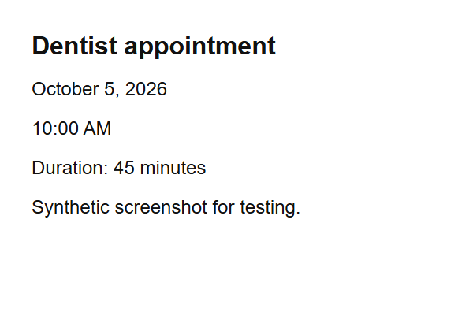
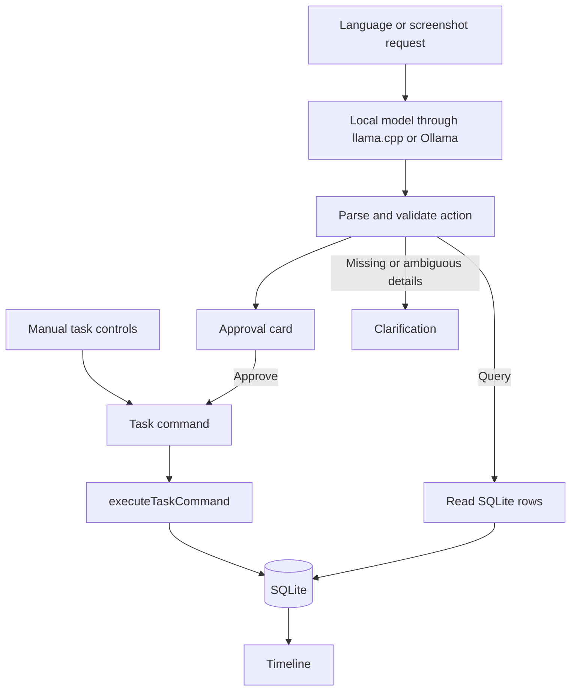

# Taskflow Local

**Your tasks, on your PC: an offline Windows timeline with local Gemma language controls and approval before every proposed change.**

Built for the [Hacktoberfest Weekend Challenge: Build for a Friend](https://dev.to/challenges/hacktoberfest-weekend-2026-10-01), October 2–5, 2026. Intended partner category: **Best Use of Gemma**. The challenge accepts local Gemma inference; this project uses it to operate real tasks rather than generate conversational answers.

**Download:** [Windows installer (.exe)](https://github.com/S-Srinivasan-06/hacktoberfest-weekend-2026-10-01/releases/download/v0.1.0/Taskflow-Local-0.1.0-windows-x64-setup.exe) · [Portable ZIP](https://github.com/S-Srinivasan-06/hacktoberfest-weekend-2026-10-01/releases/download/v0.1.0/Taskflow-Local-0.1.0-windows-x64-portable.zip) · [Release notes and SHA-256 checksums](https://github.com/S-Srinivasan-06/hacktoberfest-weekend-2026-10-01/releases/tag/v0.1.0)

The Windows x64 release includes the app and llama.cpp runtime. Model weights are a separate download. You can use every manual task control before installing a model.

Release sizes: approximately **13.9 MiB** for the installer and **24.2 MiB** for the portable ZIP. [Recorded build provenance and asset hashes](docs/verification/release-v0.1.0.json) connect these files to the reviewed application source.

[The problem](#why-taskflow-local-exists) · [Demo walkthrough](#demo-walkthrough) · [Language commands](#exactly-how-language-commands-work) · [Installation](#installation-requirements-and-exe-usage) · [Model setup](#model-file-placement) · [Architecture](#architecture-and-tech-stack) · [Evidence and limits](#checks-and-known-limitations) · [Deadline disclosure](#post-deadline-change-disclosure--updated-october-5-2026-utc)

## Why Taskflow Local exists

A friend saw my Taskflow web application and wanted the same idea on their own PC, with language controls to make it easier to use. Taskflow Local turns that request into a Windows desktop application: open a timeline, add or edit tasks directly, or type what you want to change.

The goal is practical accessibility through a second input method, without requiring an account, a hosted service, or a subscription. The timeline remains usable when the model is absent or unloaded. This is a new desktop implementation inspired by the earlier app's visual style; it does not reuse the earlier app's task-management components or business logic.

The request was specific: keep the familiar task list on the local PC and make everyday operations easier through language. A person should be able to write “move reading to 9 tomorrow,” see the exact date and time that means, and decide whether to save it. They should also be able to ignore the language input and edit the same task directly. Screenshot input extends this idea to an appointment or task already written in an image.

For example, an appointment screenshot currently requires the person to read it, remember its details, open a form, and re-enter the information. Taskflow can turn that image into a draft task locally. Moving an existing task can similarly begin with a sentence rather than a sequence of form edits. The review step remains visible because saving the wrong time would defeat the purpose of making task management easier. These are the intended benefits of the design; they have not been measured in a user study.

That shaped the product: the timeline takes priority, the language feature starts only when needed, and the model proposes changes instead of controlling storage. The app also follows familiar desktop behavior: closing its window leaves it in the tray, while an explicit Quit ends the session. The friend's identity is private. No friend testimonial, measured accessibility improvement, or completed handover is being claimed here.

## What was built during the challenge window

The challenge runs from **October 2, 2026, 02:00 UTC** to **October 5, 2026, 06:59 UTC**. This snapshot documents work completed by **October 4, 2026**, before the deadline:

- A Windows Tauri application with a visible window, system tray, close-to-tray, Open/Quit, and single-instance restoration.
- A SQLite timeline with manual create/edit, status, read/unread, and soft delete.
- Local Gemma integration for create, query, update, delete, status, read/unread, and clarification.
- Strict action validation, approval cards, and one shared task-writing path.
- On-demand model startup, health checks, early-exit detection, restart retry, idle unloading, and shutdown cleanup.
- A production EXE and an NSIS installer containing the pinned llama.cpp runtime and DLLs.
- Unit tests, mocked browser checks, real-model contract tests, and project documentation.
- An October 4 update added desktop reminders, five colour schemes, compact task rows, search/filter controls, keyboard shortcuts, local model selection, optional Ollama support, and screenshot-to-task proposals. This update is also before the deadline.

The installed-build acceptance check is still outstanding. There was no prior Git history in the local project before its initial commit, so this is a snapshot of the challenge work, not a reconstructed day-by-day commit history.

## Key features

- **Time-ordered timeline:** past above NOW, future below; the next upcoming unfinished task gets a stronger rule.
- **Manual controls:** title, local date/time, optional duration, status, read/unread, and delete confirmation.
- **Language controls:** describe one action in ordinary words and review the resolved task and time.
- **Approval before language-driven writes:** Approve saves; Cancel discards.
- **Real query results:** answers are selected from SQLite, not invented by the model.
- **Local persistence:** tasks survive normal Quit and reopen; dates are stored in UTC and shown locally.
- **Desktop behavior:** closing the window hides it; the tray remains; opening again restores the existing window.
- **Model independence:** app startup does not load the model; manual task management works without it.
- **Reminders:** Windows notifications at the task time or a selected interval before it, including while the window is hidden in the tray.
- **Compact controls:** search, status/date filters, and Classic, Slate, Nord, Dracula, and Solarized colour schemes.
- **Local model selection:** choose downloaded GGUF files or locally installed Ollama models in Settings.
- **Screenshot input:** attach a PNG/JPEG or focus the request box and paste an image with **Ctrl+V** (up to 5 MB), then review one proposed task using an image-capable model. Images are not saved as attachments.

**October 5 source update (before the deadline):** the request box now stays visible while tasks/settings and long results scroll, a **Chat** button focuses it, and clipboard images use the existing attachment validation and approval flow. The updated local executable was rebuilt successfully; the published `v0.1.0` assets still contain the earlier build. Typecheck, 32 existing checks, Rust check, and the Windows build passed. A synthetic browser fixture verified image pasting and small-window scrolling; real Windows notification banner delivery remains unverified.

## Screenshots

These show the real React interface with **synthetic task data and mocked desktop/model IPC** from the browser tests. They are not evidence of an installed Windows tray or native model-lifecycle test.

### Timeline and manual controls


### Empty timeline


### Image interpretation evidence



This synthetic image was sent to the pinned Gemma model with its matching projector. The recorded result was a **Dentist appointment** proposal for **October 5, 2026, 10:00 AM IST**, lasting **45 minutes**. The app's validated command stores that time as `2026-10-05T04:30:00.000Z`. See the [actual result JSON](docs/verification/vision-results.json). The image and result are evidence for that single example, not a claim that every screenshot is understood correctly.

## Demo walkthrough

Use the [downloadable Windows release](https://github.com/S-Srinivasan-06/hacktoberfest-weekend-2026-10-01/releases/tag/v0.1.0) to follow this path. It demonstrates the intended user flow; the installed Windows checks listed later remain outstanding.

1. Open Taskflow. Add **Read a chapter** for tomorrow at 8 PM using **+ New task**, without loading the model.
2. Edit the task and select a reminder 15 minutes before. Try the search and date/status filters, then choose a colour scheme in Settings.
3. After model setup, type **“Move Read a chapter to tomorrow at 9 PM.”** Read the approval card. The original task stays unchanged until **Approve**; **Cancel** discards the proposal.
4. Type **“What do I have tomorrow?”** The result is read from SQLite and needs no approval.
5. Try **“Mark Read a chapter unread”**, then **“Mark Read a chapter as done.”** Each produces its own approval card; read state and completion are independent.
6. Attach an appointment screenshot with **Image** and ask for a task. Supply a time if asked, then inspect the proposal before saving.
7. Close the window and reopen it from the tray. Use **Quit** from the tray menu to exit, then relaunch to inspect saved tasks.

To inspect reminder delivery, create a disposable task a few minutes ahead with **At task time**, allow notifications, and leave the app in the tray. Windows Do Not Disturb may suppress the banner.

## Exactly how language commands work

1. Type a request into **Tell Taskflow something…** and select **Send**.
2. The selected local runtime starts if needed. For bundled llama.cpp, Rust starts the process and polls its health with a roughly 120-second startup deadline. Ollama must already be running separately.
3. TypeScript builds the prompt from static rules and real-date examples, an en-US 14-day date table, up to 25 nearby tasks numbered `1..N`, and the current local time. UUIDs are not sent to the model.
4. The selected model returns **one JSON action**, constrained by a per-request schema. It receives no SQL, shell, filesystem tools, or tool loop.
5. Zod validates the action, required fields, reference bounds, and actual calendar dates. Invalid output gets one correction retry, then a plain-language error.
6. A mutation becomes an approval card showing the operation, task title, resolved date/time, and supplied duration. **No task-row write occurs before Approve.**
7. Approve calls `executeTaskCommand()`, the same function used by manual controls, then refreshes the timeline. For existing tasks, the UI rechecks whether the task changed after the proposal was made.
8. A query reads SQLite immediately and displays those rows, without an approval card.

| Operation | Example | Result |
| --- | --- | --- |
| Create | “Add gym tomorrow at 7 AM for one hour.” | A create proposal with a concrete date/time and 60-minute duration |
| Query | “What do I have tonight?” | SQLite tasks in the resolved time range |
| Update | “Move gym to tomorrow at 9 AM.” | An update proposal; unspecified fields stay unchanged |
| Delete | “Delete gym.” | A delete proposal; approval soft-deletes the task |
| Status | “Mark gym as done.” | A status proposal; supported states are todo, in progress, and done |
| Read/unread | “Mark the report unread.” | A read-state proposal, separate from completion |
| Clarify | “Add gym.” | “When?” because every task needs a scheduled time |

Supported queries are **range, open, unread, done, and next**. “Open” means unfinished; “next” selects the next future unfinished task. Range ends are exclusive.

If references are ambiguous, the app asks which task and offers dated task buttons instead of accepting a guessed mutation. Missing details can be answered in the same composer. Requests are serialized and Send is disabled while one is running. Review every proposal: schema validity does not guarantee that a language model understood your intent.

### Worked example: moving a task

Suppose the local date is **October 4, 2026**, the PC uses **Asia/Kolkata**, and the timeline contains **Read a chapter** tomorrow at 8 PM, with a reminder 15 minutes before it. The user types:

> Move Read a chapter to tomorrow at 9 PM.

The prompt contains a numbered task reference and a date table that makes “tomorrow” October 5. If that task is reference 1, the expected model action is:

```json
{
  "action": "update",
  "task_ref": 1,
  "scheduled_at_local": "2026-10-05T21:00:00"
}
```

The validator checks the reference and the date. Application code maps `1` back to the task's UUID and converts 9 PM IST to `2026-10-05T15:30:00.000Z`. The approval card shows the new local time, the previous task/time, and the moved reminder at 8:45 PM. Nothing has been saved at this point.

On **Approve**, the app first checks whether the task changed since the proposal was made, then sends the update through the shared task service. The service preserves omitted fields, moves the existing reminder by the same lead time, updates the timestamp, and refreshes the timeline from SQLite. **Cancel** produces no task write. This is an illustrative walkthrough of the code path, not an additional recorded model test.

For **“What do I have tomorrow?”**, the model instead proposes a `range` query. The app converts its local day boundaries to UTC and selects matching SQL rows. The model does not compose an answer from memory. For **“Add reading”**, there is no time to store, so the next step is a clarification rather than a guessed appointment.

## Basic usage

Manual: select **+ New task**, enter a title and time, then save. Use each row's controls to edit, change status, mark read/unread, or delete.

Search matches task titles. Combine it with status and local-date filters. Outside text fields, **N** or **C** opens the task editor, **/** focuses search, and **Esc** closes the editor/settings or clears filters. Choose a colour scheme in **Settings**; it is remembered on restart.

### Desktop reminders

In the task editor, choose **At task time**, or **5, 15, 30, or 60 minutes before**, then save. Allow notifications when requested. Completing or deleting a task cancels its reminder; moving a task preserves its reminder lead time. A successful notification clears the saved reminder through the same task-command service.

Reminder setup currently uses the manual editor. Language commands can move a task that already has a reminder, but the action contract does not yet include a command for choosing a new reminder interval.

The native timer runs while Taskflow is open, including when the window is hidden. **Tray → Quit stops reminders.** On restart, reminders missed by up to five minutes can be delivered; older missed reminders are not replayed. Windows notification settings and Do Not Disturb affect delivery. Actual toast delivery still needs an installed-build check.

English examples:

- “Add reading tomorrow at 8 PM for 30 minutes.”
- “Show my unread tasks.”
- “Move reading to tomorrow at 9 PM.”
- “Mark reading as done.”
- “Delete reading.”

Tamil example to try:

> நாளை காலை 9 மணிக்கு அம்மாவை அழைக்க வேண்டும் என்ற பணியைச் சேர்.

Meaning: add a task to call Amma tomorrow at 9 AM. Titles are kept in the user's language. **This non-English request has not been verified against the real model**; the five recorded model checks were in English. Check the proposed title and time before approving.

## Local, offline, and privacy behavior

After installing the app, runtime, and model, normal task operations and language requests work without an internet connection.

- No application account, cloud sync, telemetry, or remote model API.
- SQLite task data remains in the Windows user's application directory.
- Bundled model requests go only to `127.0.0.1:39281`; the server binds to loopback and uses a per-session API key. Optional Ollama requests go to `127.0.0.1:11434`.
- Native HTTP permissions allow only those two local model addresses, and redirects are disabled. Ollama cloud tags and models reporting remote metadata are rejected before task context is sent.
- Production code does not log task text or prompts; the runtime's output is suppressed.
- Chat and pending proposals exist only in React memory and are discarded on restart.
- Screenshot inputs also stay in memory. Theme/model preferences use WebView storage; tasks remain in SQLite. When using separately managed Ollama, its own settings and logging remain under your control.
- Initial downloads, source dependency installation, and any WebView2 installation require internet access.
- Local does **not** mean encrypted: the SQLite database and model files are ordinary files protected by Windows permissions, not an app-level password or encrypted vault.

## Gemma and llama.cpp

The default model is Google's **Gemma 4 E2B instruction-tuned QAT Q4_0 GGUF** checkpoint through a pinned Windows CPU build of **llama.cpp**. Text commands require only the model file. Screenshot input additionally requires its matching multimodal projector.

| Item | Pinned value |
| --- | --- |
| Model repository | [google/gemma-4-E2B-it-qat-q4_0-gguf](https://huggingface.co/google/gemma-4-E2B-it-qat-q4_0-gguf/tree/675cff42a74c774d6cb76f76d8eacb49b48c9b93) |
| Model revision | `675cff42a74c774d6cb76f76d8eacb49b48c9b93` |
| Expected filename | `gemma-4-E2B_q4_0-it.gguf` |
| Model size | 3,349,516,256 bytes, about 3.35 GB |
| Model SHA-256 | `fa401b55b07ee70a54c6dae3903c783a6e65064312529ea57175cb5f8dec6634` |
| Optional image projector | `gemma-4-E2B-it-mmproj.gguf`, 986,833,664 bytes |
| Projector SHA-256 | `021059cce659fe7f9170d5599761d7bbaf644b798dab9503aca30dc43e6beb14` |
| Runtime | llama.cpp `b11146`, `0.5.0-dev`, commit `7fe450e19` |
| Runtime archive | [llama-b11146-bin-win-cpu-x64.zip](https://github.com/ggml-org/llama.cpp/releases/download/b11146/llama-b11146-bin-win-cpu-x64.zip) |
| Runtime archive SHA-256 | `14cf1303ca9ac3abd94816850532f9f9a69ac66fbaca3776fc6f9061c2fac1d1` |

The code's source of truth for these pins is [modelConfig.ts](src/model/modelConfig.ts).

Runtime arguments include `--host 127.0.0.1 --ctx-size 4096 --parallel 1 --jinja`. Every completion uses `temperature: 0`, `max_tokens: 256`, and `chat_template_kwargs: { enable_thinking: false }`.

For this exact build, schema enforcement was verified with the nested form:

```json
{
  "response_format": {
    "type": "json_schema",
    "json_schema": {
      "name": "taskflow_action",
      "strict": true,
      "schema": {}
    }
  }
}
```

The empty schema above illustrates the envelope only; the actual request supplies the generated action schema. A schema-enforcement canary and five synthetic prompts passed, including full 25-task context. See [the recorded results](docs/verification/phase0-results.json) and [test script](tests/phase0-smoke.mjs). Do not silently upgrade either pin.

A real-model screenshot check also passed: a synthetic appointment image produced the expected title, date/time, and duration, with no task write before approval. See [vision results](docs/verification/vision-results.json) and [the vision check](tests/vision-smoke.mjs). This verifies one simple image, not general screenshot accuracy.

### Why local, open inference matters

A closed hosted API would require sending task context off the PC, maintaining internet access, and depending on a provider's service and pricing. Gemma's available weights and llama.cpp's open-source runtime let the language feature run on the same computer as the tasks, without a paid inference API or provider account.

The runtime can be inspected, rebuilt, and pinned alongside the application. That does not make the model infallible or free of hardware costs: CPU inference uses local memory and processing time, and this V1 has no validated minimum RAM or speed guarantee. “OpenAI-compatible” describes the local HTTP protocol; it does not mean the app calls OpenAI.

| Need in this project | What the open/local approach enables | Tradeoff |
| --- | --- | --- |
| Keep personal task context on the PC | Run the weights through a loopback-only runtime | The user supplies disk space and local compute |
| Continue without internet | Manual use and downloaded-model requests work offline | Initial downloads still require connectivity |
| Inspect the interpretation boundary | Read the prompt, JSON schema, validator, and approval code | Model output can still be semantically wrong |
| Avoid dependence on one hosted endpoint | Pin the runtime and select compatible local models | Alternative models require their own compatibility checks |
| Read an appointment screenshot locally | Use Gemma's matching image projector | The projector is another download and uses additional resources |

Gemma is the language and image interpretation component. It is not used to generate query answers, choose SQL, or execute commands. That boundary is the practical contribution of this integration: natural language becomes another route into a conventional, inspectable task service. Taskflow's original application code is currently **unlicensed**, as explained below; its public availability should not be confused with an open-source license for the whole app.

## Installation requirements and EXE usage

**For an end user:** a Windows x64 PC and Microsoft Edge WebView2. The CPU runtime is bundled; a GPU, Node, Rust, Python, Ollama, and API keys are not required to use an installed app.

Allow disk space for the app and the approximately 3.35 GB model, plus approximately 987 MB for optional screenshot support and working space for downloads. The runtime/model were checked on the development machine, not across a hardware compatibility matrix.

The generated installer is:

```text
src-tauri/target/release/bundle/nsis/Taskflow Local_0.1.0_x64-setup.exe
```

Download the installer from [GitHub Releases](https://github.com/S-Srinivasan-06/hacktoberfest-weekend-2026-10-01/releases/tag/v0.1.0). Release binaries are attached as assets rather than checked into source history.

1. Run the installer and finish setup.
2. Launch **Taskflow Local** from the Start menu.
3. Add a task manually; no model is needed for this.
4. Install the model as described below to enable language commands.
5. Closing the window keeps the app in the tray. Windows may place the icon inside the **^** overflow menu.
6. Left-click the tray icon or choose **Open** to restore the window. Right-click and choose **Quit** to stop the app and model completely.

The build is unsigned. Windows may show SmartScreen; for a build you trust from this project, select **More info → Run anyway**.

The direct release EXE is `src-tauri/target/release/taskflow-local.exe`. Keep the matching `runtime/llama/` directory beside it; moving only the EXE breaks language runtime discovery. The installer supplies that layout automatically.

For the portable package, extract the **entire ZIP** into a folder and open `taskflow-local.exe` there. Its runtime folder and notices must remain beside it. The ZIP avoids app installation, but tasks and model files still use the Windows user data folders below; this is not a self-contained USB data store. Use the installed version when checking Windows notifications.

### Verify a release download

Download `SHA256SUMS.txt` from the same release and compare its entry with:

```powershell
Get-FileHash -Algorithm SHA256 -LiteralPath '.\Taskflow-Local-0.1.0-windows-x64-setup.exe'
```

The checksums identify the published files. They do not replace code signing; this release remains unsigned. To replace an older build, choose **Quit** in its tray menu first, then install the new build. Task/model storage is separate from the program directory.

## Model-file placement

The installer contains the runtime, all its DLLs, and runtime license notices. **It does not contain or automatically download model or projector files.**

1. Download [the pinned GGUF file](https://huggingface.co/google/gemma-4-E2B-it-qat-q4_0-gguf/resolve/675cff42a74c774d6cb76f76d8eacb49b48c9b93/gemma-4-E2B_q4_0-it.gguf).
2. In the app, choose **Settings → Open Models Folder**, or use the missing-model control.
3. Place the file there with this exact name: `gemma-4-E2B_q4_0-it.gguf`.
4. Select **Check for model**, then send a request. Restarting the app is not required.

The Windows path is:

```text
%LOCALAPPDATA%\com.taskflow.local\models\gemma-4-E2B_q4_0-it.gguf
```

Verify the downloaded file in PowerShell:

```powershell
Get-FileHash -Algorithm SHA256 -LiteralPath "$env:LOCALAPPDATA\com.taskflow.local\models\gemma-4-E2B_q4_0-it.gguf"
```

Compare the result with the pinned hash above. The app currently checks file presence, not the hash at every startup. The development copy was hash-verified and downloaded anonymously; a literal private-browser-window download was not separately checked.

### Screenshot input and other downloaded models

For the default Gemma model, download [the matching projector](https://huggingface.co/google/gemma-4-E2B-it-qat-q4_0-gguf/resolve/675cff42a74c774d6cb76f76d8eacb49b48c9b93/gemma-4-E2B-it-mmproj.gguf) into the same Models folder and verify its hash above. Choose it under **Image projector** in Settings. It loads only when an image request needs it.

Select **Image** beside the composer, attach one PNG/JPEG up to 5 MiB, and type an instruction or send the image alone. The model proposes one task. If the screenshot has no usable time, answer the clarification. Review the title, time, and duration before approving; images never bypass validation or approval.

For another GGUF model, place it directly in the Models folder, choose **Refresh** in Settings, then select it. Choose its matching projector if it supports images. Changing models unloads the app-owned runtime. Alternative model compatibility and accuracy have not been checked against real models.

### Optional Ollama

If you already use [Ollama](https://docs.ollama.com/), start it locally and download a local model using its own tools. Settings lists available local models from `127.0.0.1:11434`; Taskflow does not install Ollama or pull models. Cloud models are excluded. Screenshot input requires a model advertising vision support.

Ollama uses the same JSON schema, validation, and approval flow. The official Tauri HTTP plugin handles local requests without requiring WebView CORS configuration. Requests disable thinking and use a 60-second development / 30-minute production keep-alive. **Unload model** requests unloading; quitting Taskflow does not terminate a separately managed Ollama service. This provider has been tested with mocks, not a real Ollama installation.

## Build and run from source

Development requires Git, **Node 24** with npm (verified with 24.20.0), a Rust MSVC toolchain, Windows C++ build tools, and WebView2. See [Tauri's Windows prerequisites](https://v2.tauri.app/start/prerequisites/). Runtime and model binaries are intentionally ignored by Git.

```powershell
git clone https://github.com/S-Srinivasan-06/hacktoberfest-weekend-2026-10-01.git
cd hacktoberfest-weekend-2026-10-01
npm ci
```

Prepare the pinned runtime before a native build:

1. Download the runtime ZIP linked above and verify its SHA-256 with `Get-FileHash`.
2. Extract it. Copy `llama-server.exe` and **every DLL from that build** into `src-tauri/runtime/llama/`.
3. Rename `llama-server.exe` to `taskflow-llama.exe`.
4. Preserve `LICENSE-LLVM-OpenMP` from the archive and include the [pinned llama.cpp MIT license](https://github.com/ggml-org/llama.cpp/blob/b11146/LICENSE) as `LICENSE.llama.cpp`.
5. Place the model in the per-user folder described above. It stays outside the repository and installer.

Run the desktop app:

```powershell
npm run tauri dev
```

Build the Windows NSIS installer:

```powershell
npm run tauri build
```

Check the code:

```powershell
npm run typecheck
npm test
cargo check --locked --manifest-path src-tauri/Cargo.toml
```

For browser checks, run `npm run dev`, then `npm run test:ui` in a second terminal. The runner uses an existing Chrome or Edge installation and mocked Tauri IPC. `npm run build` builds only the frontend; real persistent storage requires the desktop app.

## Persistence and restart behavior

SQLite is the source of truth. One `tasks` table stores UUID, title, UTC scheduled time, optional duration, status, read state, optional UTC reminder time, and creation/update/deletion timestamps. Delete sets `deleted_at_utc`; normal reads exclude deleted rows. No separate reminders table is needed.

The database is `taskflow-local.db` in Tauri's per-user application config directory, normally `%APPDATA%\com.taskflow.local\`. The model is under `%LOCALAPPDATA%` separately. The app does not use browser localStorage for tasks.

Normal Quit and reopen reload saved tasks. React chat, pending approvals, and clarification state do not persist. Closing only the window keeps the same process alive.

| Data | Location/lifetime |
| --- | --- |
| Tasks, status, read state, reminder time, soft-deletion timestamps | `taskflow-local.db` in the per-user application config directory |
| Model and image projector | `%LOCALAPPDATA%\com.taskflow.local\models\` |
| Theme and selected model/projector | Local WebView preferences |
| Current request, screenshot, clarification, and pending proposal | App memory; discarded when the process ends |
| Reminder banners | Sent to Windows; notification history and visibility follow Windows settings |

Two launches restore the same running instance. They do not create independent task databases or model processes. Nothing is synchronized to other PCs, and the app has no account recovery or backup service.

The model starts on demand, unloads after **30 minutes idle in production / 60 seconds in development**, and can be unloaded manually. Startup removes stale processes named `taskflow-llama.exe` after single-instance registration; it does not target unrelated `llama-server.exe` processes.

## Architecture and tech stack

**React + TypeScript + Vite** own the UI and most logic. **Tauri 2 + thin Rust** own native window/tray, process management, and the notification timer. Official **SQL, notification, and HTTP plugins** provide SQLite storage, Windows toasts, and restricted local HTTP. **Zod** validates model output. **Gemma + llama.cpp**, or an optional local **Ollama** model, interpret requests.



`interpretUserRequest()` never mutates tasks. `taskRepository.ts` only reads. Every manual or approved mutation passes through `src/domain/taskService.ts`; schema initialization is the only other database-writing code and changes no task rows.

### How it was built and why these boundaries exist

The build started with the desktop shell, SQLite, and manual task operations. Language interpretation was added on top of those commands, followed by lifecycle/packaging work and the October 4 reminders, model selection, screenshot input, and UI update. Two source-review passes then addressed async races and error recovery. This describes the implementation sequence, not a reconstructed hourly history.

| Decision | Reason |
| --- | --- |
| One `tasks` table and one write service | Manual controls and approved model actions share the same validation and persistence behavior |
| One JSON action per request | Every proposed operation can be shown completely before approval; there is no autonomous tool loop |
| Numbered nearby task references | The model gets a bounded context; validated numbers map back to IDs inside the app |
| UTC storage, explicit local-time validation | The UI can show local dates while storage remains sortable; invalid dates and daylight-saving gaps are rejected |
| Native reminder timer | Due-time checks continue when the WebView window is hidden |
| Separate model/runtime packaging | The installer remains small and manual task management does not depend on model downloads |
| Lazy startup and idle unloading | Opening a task list does not immediately load model weights |

The most consequential review fixes concerned lifecycle boundaries: permission dialogs must not allow duplicate saves, a stale editor must not resurrect a delivered reminder, and an idle check must not race with a new model request. Failed image requests now retain their input; model-folder refreshes update image capability without restarting the app. No additional framework or service was needed for these fixes.

### What the development process exposed

**Structured output is only the first check.** Constraining output to JSON narrows what the model can say, but valid JSON can still identify the wrong task or invent an impossible date. The second layer validates references, required fields, and real local dates. The final layer is the person's approval. The app treats these as separate responsibilities.

**Local inference still needs lifecycle engineering.** A downloaded model is not automatically a desktop feature. The app must find the runtime and every DLL, locate the weights outside the installation directory, keep its server on loopback, distinguish “loading” from “dead,” and release memory when idle. Manual task editing must remain available throughout those states.

**Reminder state has two representations.** SQLite stores the durable reminder time; a small Rust queue schedules delivery while the app is running. Delivery is acknowledged using both task ID and expected reminder time, so a late acknowledgment cannot clear a newly moved reminder. The native queue does not become a second task database.

**Review found failures that a happy-path screenshot would miss.** A permission dialog adds an asynchronous wait before saving. Without a synchronous submission guard, two clicks could become two saves. Similarly, separately checking whether a model is idle and then stopping it allows a new request to arrive between the two operations. The reviewed implementation locks those boundaries and preserves failed inputs for retry.

These are engineering observations from the implementation and source review. They should not be read as claims of a completed accessibility study, exhaustive concurrency testing, or a clean-machine acceptance pass.

## Project structure

```text
src/
  app/                    Main screen and database bootstrap
  components/
    timeline/             Ordered tasks and NOW marker
    task/                 Manual editor
    composer/             Requests, approvals, queries, clarification
    common/               Settings and model/theme controls
  db/                     SQLite adapter/schema and read-only repository
  domain/                 Task types, commands, dates, filters, reminders, write service
  model/                  Pins, schemas, prompt/context, client/service, desktop transport
  state/                  Task state, reminder events, preferences
  styles/                 Design tokens and global styles
src-tauri/
  src/lib.rs              Tray, window behavior, single instance
  src/model_process.rs    Runtime startup, stop, idle timer, stale cleanup
  src/reminders.rs        Native reminder queue and notification delivery
  runtime/llama/          External runtime files; ignored by Git
  tauri.conf.json         Window, CSP, resources, NSIS packaging
tests/                    Unit tests, browser fixtures, model smoke test
docs/                     Synthetic screenshots and model-test evidence
```

## Checks and known limitations

**Passed on the development machine:** TypeScript typecheck, 32 unit tests, Rust checks and release compilation, three mocked browser scenarios, strict schema enforcement, five real-model prompts, one real-model screenshot check, and updated NSIS packaging.

**Release provenance:** the 32 unit tests, three mocked browser scenarios, and real-model results above were recorded before the two final code-review passes. At the user's request, tests were not rerun during those passes. The published executable is rebuilt from the reviewed source; its release build includes TypeScript checking and Rust compilation, but compilation does not establish runtime correctness. The release tag identifies the source and `SHA256SUMS.txt` identifies its binary assets.

Unit tests cover dates, reference validation, ambiguity, retry/locking, one write path, queries, reopening a real SQLite file, reminders, filters, and provider/image payloads. Browser tests cover manual controls, themes, model selection, screenshot proposals, and approval before writes. The installer includes the runtime EXE, DLLs, and licenses and excludes model/projector files.

**Not verified:** installation on a clean Windows account; actual tray interaction; native persistence and notification delivery through the installed UI; model requests, idle restart, and Quit cleanup through that UI; a real Ollama provider. An installer build is not an installed-build acceptance test.

Other limits:

- Windows x64 only; unsigned installer.
- One action per request; at most 25 nearby tasks in the model context.
- Supported query kinds are fixed; no arbitrary SQL or general-purpose assistant.
- Language interpretation can be wrong even when valid JSON is returned.
- Non-English inference and screen-reader/accessibility compliance have not been validated.
- CPU resource use depends on the machine; no minimum RAM or performance promise.
- File download and hash verification are manual; no automatic model repair.
- Idle unloading happens natively; the UI may still say Ready until it next checks the process.
- Soft deletion has no restore UI; no automatic backups.
- Reminders require the app to remain running; they do not register Windows scheduled tasks or Windows Calendar events.
- Screenshot input supports one PNG/JPEG and one proposed task, not bulk extraction, persisted attachments, or general image chat.
- Other selected models may fail the action schema or misinterpret commands; the default pinned Gemma is the only real model checked here.

### Troubleshooting

| Symptom | What to check |
| --- | --- |
| Local model is missing | Use **Settings → Open Models Folder**, check the filename, and choose **Refresh models** |
| Image input is unavailable | Select an installed model and its matching projector, then refresh; Ollama must advertise vision capability |
| Ollama models do not appear | Start the separate local Ollama service and ensure a model has already been downloaded; cloud models are excluded |
| A request fails or times out | Keep the retained text/image, check the selected model, try **Unload**, then retry; manual tasks remain available |
| No reminder banner appears | Keep Taskflow running, use an installed build, and check Windows notification permissions/Do Not Disturb |
| The window disappears after closing | Find Taskflow in the tray, including the **^** overflow menu, and choose **Open** |
| A proposal says the task changed | Send the request again so it uses the latest saved task; the app does not overwrite the stale proposal silently |
| Portable language controls cannot start | Extract the full ZIP and keep `runtime/llama/` beside the executable |

## Hacktoberfest submission context

The [official challenge](https://dev.to/challenges/hacktoberfest-weekend-2026-10-01) asks for a new project built during its window, the real person's problem, a demo, the build process, and an explanation of open innovation. This README supplies the project story, screenshots, downloadable app, architecture, and evidence for that write-up. The original web Taskflow is credited as inspiration; this repository contains the new desktop implementation.

| Submission topic | Project material |
| --- | --- |
| What was built and who it helps | The private friend's request for a local desktop version with easier language-based task operations |
| Demo | Windows release, synthetic UI screenshots, a real-model image result, and the reproducible walkthrough above |
| Code | This repository, source-linked architecture, and release tag |
| Build process | Manual-first SQLite implementation, bounded model actions, native lifecycle, reminders, and two source-review passes |
| Why open innovation matters | Downloadable weights, inspectable runtime, offline operation, local task context, and the ability to select another compatible model |
| Partner technology | Gemma supplies the text and image interpretation; llama.cpp runs it locally |

The most important connection to the theme is the original request: retain the familiar task-management idea on the friend's own PC and add a more accessible way to operate it. The extra controls support that request. The README does not claim that the friend has already accepted every feature or that the app has passed accessibility certification.

**Prize category: Best Use of Gemma.** The pinned Gemma weights power both structured task interpretation and the recorded screenshot example locally. No fine-tuning, hosted Gemma endpoint, or trained custom model is claimed.

Publishing this repository and release does not itself submit an entry on DEV. The DEV post uses the challenge's submission template with `devchallenge`, `weekendchallenge`, and `hf26challenge` tags. A session transcript is optional. Friend feedback should only be added after an actual handover; no testimonial has been invented for this README.

## Deliberately cut from V1

To keep the challenge focused: automatic model download, undo/event log, recurrence, projects/labels/kanban, bulk edits, persisted attachments, voice, cloud sync/accounts, Windows Calendar integration, launch at login, global shortcuts, and persisted chat. Reminders, local model selection, and temporary screenshot input were added in the October 4 update.

## Future work

First finish the installed Windows acceptance pass, including reminders, and gather feedback from the person using it. Then improve screen-reader usability, test non-English commands and a real Ollama provider, and check more screenshot formats and layouts. A streaming model downloader with SHA-256 validation is a possible later improvement.

## Attribution and licenses

- **Original project code:** no license has been granted yet. Public source availability alone does not grant reuse rights. No MIT or Apache license is being assigned to Taskflow Local in this snapshot.
- **Design inspiration:** the author's earlier [Taskflow web application](https://github.com/S-Srinivasan-06/Taskflow). Only literal visual values—colors, font choices, border, radius, and shadow offsets—were carried into `src/styles/tokens.css`; earlier components/business logic were not copied. Search, filters, and keyboard shortcuts were implemented independently for this desktop app.
- **Model:** Google's pinned Gemma GGUF [model card](https://huggingface.co/google/gemma-4-E2B-it-qat-q4_0-gguf/blob/675cff42a74c774d6cb76f76d8eacb49b48c9b93/README.md) declares **Apache-2.0**. The weights are a separate upstream artifact and are not licensed by this repository.
- **Image projector:** a separate artifact from the same pinned Google model repository and license; it is not bundled with the app.
- **Additional palettes:** [Nord](https://www.nordtheme.com/docs/colors-and-palettes/) and [Dracula](https://draculatheme.com/contribute) colours follow their published palette references; controls retain Taskflow's visual style. The Solarized option is a light palette inspired by [Solarized](https://ethanschoonover.com/solarized/).
- **Runtime:** [llama.cpp b11146](https://github.com/ggml-org/llama.cpp/tree/b11146), **MIT**. Bundled LLVM/OpenMP notices use **Apache-2.0 with LLVM exceptions** and are preserved in the package.
- **Libraries:** React/React DOM, Vite, and Zod (MIT); TypeScript (Apache-2.0); Tauri and its plugins (MIT OR Apache-2.0); SQLite (public domain). Upstream and transitive dependency notices continue to apply.
- **Development assistance:** implementation and checks were assisted by OpenAI Codex. The application's inference runs locally with Gemma, independently of that development tooling.
- No third-party task text or original Taskflow implementation is included in the screenshots; their data comes from synthetic test fixtures.

## Post-deadline change disclosure — updated October 5, 2026 (UTC)

**Deadline: October 5, 2026, 06:59 UTC.** The [DEV challenge rules](https://dev.to/challenges/hacktoberfest-weekend-2026-10-01) require commits after the submission deadline to be noted in the README.

**As of October 5, 2026, 04:39 UTC, there are no post-deadline commits or changes: the deadline has not occurred.** The initial source snapshot, feature update, two code-review passes, README expansion, `v0.1.0` release preparation, and October 5 clipboard/scrolling fixes are all pre-deadline work. Git history records the actual commit times; verification of the latest source is described above separately from the published release evidence.

| UTC date/time | Commit/change | Scope and effect |
| --- | --- | --- |
| None as of 2026-10-05 04:39 UTC | No post-deadline changes | Pre-deadline snapshot |

Pre-deadline source milestones: [`e1517d0`](https://github.com/S-Srinivasan-06/hacktoberfest-weekend-2026-10-01/commit/e1517d01063e4a0c68014729f3d62d0ac81ca5f8) records the initial desktop snapshot; [`ca56052`](https://github.com/S-Srinivasan-06/hacktoberfest-weekend-2026-10-01/commit/ca56052fb236aa326c5a4dee022bb506e05f27fa) records the feature update and both code-review passes. The `v0.1.0` tag also includes the expanded documentation and release evidence.

For every later post-deadline commit or uncommitted change, append its actual UTC date/time, commit hash when available, files/features affected, and whether it changes functionality, packaging, documentation, or demo assets. Keep this section even for README-only or demo-only updates. Do not backdate commits or describe later work as part of the deadline build.
