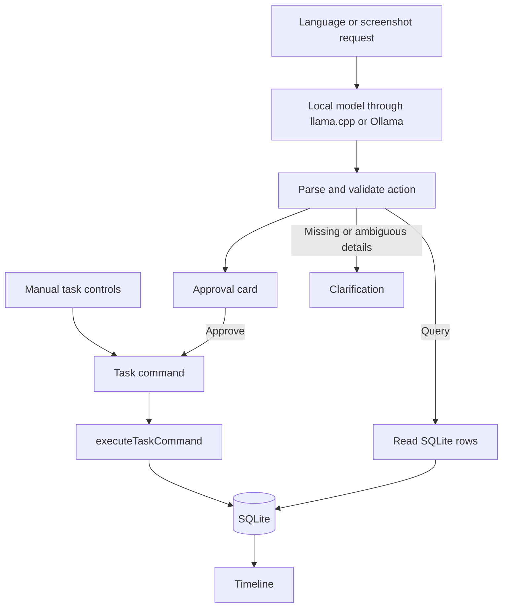

# Developing Taskflow Local

[Back to the README](../README.md) · [User guide](usage.md)

## Build and run from source

Development requires Git, **Node 24** with npm (verified with 24.20.0), a Rust MSVC toolchain, Windows C++ build tools, and WebView2. See [Tauri's Windows prerequisites](https://v2.tauri.app/start/prerequisites/). Runtime and model binaries are intentionally ignored by Git.

```powershell
git clone https://github.com/S-Srinivasan-06/Taskflow-Local-hacktoberfest-weekend.git
cd Taskflow-Local-hacktoberfest-weekend
npm ci
```

Prepare the pinned runtime before a native build:

1. Download the [pinned runtime ZIP](#gemma-and-llamacpp) and verify its SHA-256 with `Get-FileHash`.
2. Extract it. Copy `llama-server.exe` and **every DLL from that build** into `src-tauri/runtime/llama/`.
3. Rename `llama-server.exe` to `taskflow-llama.exe`.
4. Preserve `LICENSE-LLVM-OpenMP` from the archive and include the [pinned llama.cpp MIT license](https://github.com/ggml-org/llama.cpp/blob/b11146/LICENSE) as `LICENSE.llama.cpp`.
5. Place the model in the [per-user Models folder](usage.md#model-file-placement). It stays outside the repository and installer.

Run the desktop app:

```powershell
npm run tauri dev
```

Build the Windows NSIS installer:

```powershell
npm run tauri build
```

Check the code:

```powershell
npm run typecheck
npm test
cargo check --locked --manifest-path src-tauri/Cargo.toml
```

For browser checks, run `npm run dev`, then `npm run test:ui` in a second terminal. The runner uses an existing Chrome or Edge installation and mocked Tauri IPC. `npm run build` builds only the frontend; real persistent storage requires the desktop app.

## Project structure

```text
src/
  app/                    Main screen and database bootstrap
  assets/                 Original logo and application symbol
  components/             Timeline, editor, composer and settings
  db/                     SQLite schema, connection and read-only repository
  domain/                 Commands, dates, filters, reminders and the sole task write service
  model/                  Pins, schema, context, prompts and local transports
  state/                  Task state, preferences and reminder events
  styles/                 Design tokens and shared CSS
src-tauri/
  src/                    Window/tray, model process and native reminder queue
  capabilities/           Native permission scopes
  icons/                  Windows app icon resources
  runtime/llama/          Pinned runtime/DLLs/notices; ignored by Git
tests/
  unit/                   Date, persistence, model-contract and local-feature tests
  browser/                Mocked desktop page, smoke assertions and image fixture
  artifacts/              Generated local reports/screenshots; ignored by Git
scripts/                  Browser runner and human-run text/vision model checks
docs/
  usage.md                Installation, models, reminders and troubleshooting
  development.md          Architecture, model contract, pins and source setup
  challenge.md            Build story, scope, attribution and challenge evidence
  deadline-build-spec-v3.md Original challenge build plan; historical, not current scope
  releases/               Dated release notes
  screenshots/            Synthetic demo images
  verification/           Recorded model/build/release evidence
```

Keep application config at the root and native Tauri config under `src-tauri/`. The Windows identifier remains `com.taskflow.local`; the repository rename does not migrate or rename user data.


## Architecture and tech stack

**React + TypeScript + Vite** own the UI and most logic. **Tauri 2 + thin Rust** own native window/tray, process management, and the notification timer. Official **SQL, notification, and HTTP plugins** provide SQLite storage, Windows toasts, and restricted local HTTP. **Zod** validates model output. **Gemma + llama.cpp**, or an optional local **Ollama** model, interpret requests.



`interpretUserRequest()` never mutates tasks. `taskRepository.ts` only reads. Every manual or approved mutation passes through `src/domain/taskService.ts`; schema initialization is the only other database-writing code and changes no task rows.

### How it was built and why these boundaries exist

The build started with the desktop shell, SQLite, and manual task operations. Language interpretation was added on top of those commands, followed by lifecycle/packaging work and the October 4 reminders, model selection, screenshot input, and UI update. Two source-review passes then addressed async races and error recovery. This describes the implementation sequence, not a reconstructed hourly history.

| Decision | Reason |
| --- | --- |
| One `tasks` table and one write service | Manual controls and approved model actions share the same validation and persistence behavior |
| One JSON action per request | Every proposed operation can be shown completely before approval; there is no autonomous tool loop |
| Numbered nearby task references | The model gets a bounded context; validated numbers map back to IDs inside the app |
| UTC storage, explicit local-time validation | The UI can show local dates while storage remains sortable; invalid dates and daylight-saving gaps are rejected |
| Native reminder timer | Due-time checks continue when the WebView window is hidden |
| Separate model/runtime packaging | The installer remains small and manual task management does not depend on model downloads |
| Lazy startup and idle unloading | Opening a task list does not immediately load model weights |

The most consequential review fixes concerned lifecycle boundaries: permission dialogs must not allow duplicate saves, a stale editor must not resurrect a delivered reminder, and an idle check must not race with a new model request. Failed image requests now retain their input; model-folder refreshes update image capability without restarting the app. No additional framework or service was needed for these fixes.

### What the development process exposed

**Structured output is only the first check.** Constraining output to JSON narrows what the model can say, but valid JSON can still identify the wrong task or invent an impossible date. The second layer validates references, required fields, and real local dates. The final layer is the person's approval. The app treats these as separate responsibilities.

**Local inference still needs lifecycle engineering.** A downloaded model is not automatically a desktop feature. The app must find the runtime and every DLL, locate the weights outside the installation directory, keep its server on loopback, distinguish “loading” from “dead,” and release memory when idle. Manual task editing must remain available throughout those states.

**Reminder state has two representations.** SQLite stores the durable reminder time; a small Rust queue schedules delivery while the app is running. Delivery is acknowledged using both task ID and expected reminder time, so a late acknowledgment cannot clear a newly moved reminder. The native queue does not become a second task database.

**Review found failures that a happy-path screenshot would miss.** A permission dialog adds an asynchronous wait before saving. Without a synchronous submission guard, two clicks could become two saves. Similarly, separately checking whether a model is idle and then stopping it allows a new request to arrive between the two operations. The reviewed implementation locks those boundaries and preserves failed inputs for retry.

These are engineering observations from the implementation and source review. They should not be read as claims of a completed accessibility study, exhaustive concurrency testing, or a clean-machine acceptance pass.

## Exactly how language commands work

1. Type a request into **Tell Taskflow something…** and select **Send**.
2. The selected local runtime starts if needed. For bundled llama.cpp, Rust starts the process and polls its health with a roughly 120-second startup deadline. Ollama must already be running separately.
3. TypeScript builds the prompt from static rules and real-date examples, an en-US 14-day date table, up to 25 nearby tasks numbered `1..N`, and the current local time. UUIDs are not sent to the model.
4. The selected model returns **one JSON action**, constrained by a per-request schema. It receives no SQL, shell, filesystem tools, or tool loop.
5. Zod validates the action, required fields, reference bounds, and actual calendar dates. Invalid output gets one correction retry, then a plain-language error.
6. A mutation becomes an approval card showing the operation, task title, resolved date/time, and supplied duration. **No task-row write occurs before Approve.**
7. Approve calls `executeTaskCommand()`, the same function used by manual controls, then refreshes the timeline. For existing tasks, the UI rechecks whether the task changed after the proposal was made.
8. A query reads SQLite immediately and displays those rows, without an approval card.

| Operation | Example | Result |
| --- | --- | --- |
| Create | “Add gym tomorrow at 7 AM for one hour.” | A create proposal with a concrete date/time and 60-minute duration |
| Query | “What do I have tonight?” | SQLite tasks in the resolved time range |
| Update | “Move gym to tomorrow at 9 AM.” | An update proposal; unspecified fields stay unchanged |
| Delete | “Delete gym.” | A delete proposal; approval soft-deletes the task |
| Status | “Mark gym as done.” | A status proposal; supported states are todo, in progress, and done |
| Read/unread | “Mark the report unread.” | A read-state proposal, separate from completion |
| Clarify | “Add gym.” | “When?” because every task needs a scheduled time |

Supported queries are **range, open, unread, done, and next**. “Open” means unfinished; “next” selects the next future unfinished task. Range ends are exclusive.

If references are ambiguous, the app asks which task and offers dated task buttons instead of accepting a guessed mutation. Missing details can be answered in the same composer. Requests are serialized and Send is disabled while one is running. Review every proposal: schema validity does not guarantee that a language model understood your intent.

### Worked example: moving a task

Suppose the local date is **October 4, 2026**, the PC uses **Asia/Kolkata**, and the timeline contains **Read a chapter** tomorrow at 8 PM, with a reminder 15 minutes before it. The user types:

> Move Read a chapter to tomorrow at 9 PM.

The prompt contains a numbered task reference and a date table that makes “tomorrow” October 5. If that task is reference 1, the expected model action is:

```json
{
  "action": "update",
  "task_ref": 1,
  "scheduled_at_local": "2026-10-05T21:00:00"
}
```

The validator checks the reference and the date. Application code maps `1` back to the task's UUID and converts 9 PM IST to `2026-10-05T15:30:00.000Z`. The approval card shows the new local time, the previous task/time, and the moved reminder at 8:45 PM. Nothing has been saved at this point.

On **Approve**, the app first checks whether the task changed since the proposal was made, then sends the update through the shared task service. The service preserves omitted fields, moves the existing reminder by the same lead time, updates the timestamp, and refreshes the timeline from SQLite. **Cancel** produces no task write. This is an illustrative walkthrough of the code path, not an additional recorded model test.

For **“What do I have tomorrow?”**, the model instead proposes a `range` query. The app converts its local day boundaries to UTC and selects matching SQL rows. The model does not compose an answer from memory. For **“Add reading”**, there is no time to store, so the next step is a clarification rather than a guessed appointment.

## Gemma and llama.cpp

The default model is Google's **Gemma 4 E2B instruction-tuned QAT Q4_0 GGUF** checkpoint through a pinned Windows CPU build of **llama.cpp**. Text commands require only the model file. Screenshot input additionally requires its matching multimodal projector.

| Item | Pinned value |
| --- | --- |
| Model repository | [google/gemma-4-E2B-it-qat-q4_0-gguf](https://huggingface.co/google/gemma-4-E2B-it-qat-q4_0-gguf/tree/675cff42a74c774d6cb76f76d8eacb49b48c9b93) |
| Model revision | `675cff42a74c774d6cb76f76d8eacb49b48c9b93` |
| Expected filename | `gemma-4-E2B_q4_0-it.gguf` |
| Model size | 3,349,516,256 bytes, about 3.35 GB |
| Model SHA-256 | `fa401b55b07ee70a54c6dae3903c783a6e65064312529ea57175cb5f8dec6634` |
| Optional image projector | `gemma-4-E2B-it-mmproj.gguf`, 986,833,664 bytes |
| Projector SHA-256 | `021059cce659fe7f9170d5599761d7bbaf644b798dab9503aca30dc43e6beb14` |
| Runtime | llama.cpp `b11146`, `0.5.0-dev`, commit `7fe450e19` |
| Runtime archive | [llama-b11146-bin-win-cpu-x64.zip](https://github.com/ggml-org/llama.cpp/releases/download/b11146/llama-b11146-bin-win-cpu-x64.zip) |
| Runtime archive SHA-256 | `14cf1303ca9ac3abd94816850532f9f9a69ac66fbaca3776fc6f9061c2fac1d1` |

The code's source of truth for these pins is [modelConfig.ts](../src/model/modelConfig.ts).

Runtime arguments include `--host 127.0.0.1 --ctx-size 4096 --parallel 1 --jinja`. Every completion uses `temperature: 0`, `max_tokens: 256`, and `chat_template_kwargs: { enable_thinking: false }`.

For this exact build, schema enforcement was verified with the nested form:

```json
{
  "response_format": {
    "type": "json_schema",
    "json_schema": {
      "name": "taskflow_action",
      "strict": true,
      "schema": {}
    }
  }
}
```

The empty schema above illustrates the envelope only; the actual request supplies the generated action schema. A schema-enforcement canary and five synthetic prompts passed, including full 25-task context. See [the recorded results](verification/phase0-results.json) and [test script](../scripts/phase0-smoke.mjs). Do not silently upgrade either pin.

A real-model screenshot check also passed: a synthetic appointment image produced the expected title, date/time, and duration, with no task write before approval. See [vision results](verification/vision-results.json) and [the vision check](../scripts/vision-smoke.mjs). This verifies one simple image, not general screenshot accuracy.

### Why local, open inference matters

A closed hosted API would require sending task context off the PC, maintaining internet access, and depending on a provider's service and pricing. Gemma's available weights and llama.cpp's open-source runtime let the language feature run on the same computer as the tasks, without a paid inference API or provider account.

The runtime can be inspected, rebuilt, and pinned alongside the application. That does not make the model infallible or free of hardware costs: CPU inference uses local memory and processing time, and this V1 has no validated minimum RAM or speed guarantee. “OpenAI-compatible” describes the local HTTP protocol; it does not mean the app calls OpenAI.

| Need in this project | What the open/local approach enables | Tradeoff |
| --- | --- | --- |
| Keep personal task context on the PC | Run the weights through a loopback-only runtime | The user supplies disk space and local compute |
| Continue without internet | Manual use and downloaded-model requests work offline | Initial downloads still require connectivity |
| Inspect the interpretation boundary | Read the prompt, JSON schema, validator, and approval code | Model output can still be semantically wrong |
| Avoid dependence on one hosted endpoint | Pin the runtime and select compatible local models | Alternative models require their own compatibility checks |
| Read an appointment screenshot locally | Use Gemma's matching image projector | The projector is another download and uses additional resources |

Gemma is the language and image interpretation component. It is not used to generate query answers, choose SQL, or execute commands. That boundary is the practical contribution of this integration: natural language becomes another route into a conventional, inspectable task service. Taskflow's original application code is currently **unlicensed**, as explained in the [license notes](challenge.md#attribution-and-licenses); its public availability should not be confused with an open-source license for the whole app.

## Checks and known limitations

For the October 5 repository organization update, TypeScript checking, all 32 unit tests, Rust checking and the frontend build passed. Three relocated browser scenarios also passed in headless Edge with synthetic tasks and mocked desktop/model calls. All 39 local links in the README and three guides resolved. The frontend asset hashes match the published desktop update, so this organization change does not require a new installer. Real inference and native installed-app acceptance were not rerun.

**Passed on the development machine:** TypeScript typecheck, 32 unit tests, Rust checks and release compilation, three mocked browser scenarios, strict schema enforcement, five real-model prompts, one real-model screenshot check, and updated NSIS packaging.

**Release provenance:** the original `v0.1.0` evidence predates the two final code-review passes; at the user's request, tests were not rerun during those passes. For the October 5 desktop update, TypeScript checking, all 32 existing tests, Rust checking, and NSIS packaging passed again. Synthetic browser previews checked the darker Forest/Autumn themes and the minimum-size window with settings and long results. Mocked walkthroughs checked the chat switch, busy guard, approval before writes, preference restoration and manual controls with chat off; and custom-reminder creation, exact-time restoration, editing, rescheduling and invalid-time rejection. The release tag identifies the source and `SHA256SUMS.txt` identifies its binary assets. Earlier real-model results were not rerun for these UI changes.

The October 5 installer was applied to the existing Windows installation. The installed executable matched the built app after accounting for Tauri's three-byte NSIS marker, and it contained the current frontend assets. The database hash was unchanged immediately across installation; all 32 bundled runtime files matched. Windows reported notifications enabled for the registered Taskflow identity and accepted a diagnostic toast. These checks do not establish that Windows displayed a banner or that every installed UI flow passed.

Unit tests cover dates, reference validation, ambiguity, retry/locking, one write path, queries, reopening a real SQLite file, reminders, filters, and provider/image payloads. Browser tests cover manual controls, themes, model selection, screenshot proposals, and approval before writes. The installer includes the runtime EXE, DLLs, and licenses and excludes model/projector files.

**Not verified:** installation on a clean Windows account; actual tray interaction; native persistence and notification delivery through the installed UI; model requests, idle restart, and Quit cleanup through that UI; a real Ollama provider. An installer build is not an installed-build acceptance test.

Other limits:

- Windows x64 only; unsigned installer.
- One action per request; at most 25 nearby tasks in the model context.
- Supported query kinds are fixed; no arbitrary SQL or general-purpose assistant.
- Language interpretation can be wrong even when valid JSON is returned.
- Non-English inference and screen-reader/accessibility compliance have not been validated.
- CPU resource use depends on the machine; no minimum RAM or performance promise.
- File download and hash verification are manual; no automatic model repair.
- Idle unloading happens natively; the UI may still say Ready until it next checks the process.
- Soft deletion has no restore UI; no automatic backups.
- Reminders require the app to remain running; they do not register Windows scheduled tasks or Windows Calendar events.
- Screenshot input supports one PNG/JPEG and one proposed task, not bulk extraction, persisted attachments, or general image chat.
- Other selected models may fail the action schema or misinterpret commands; the default pinned Gemma is the only real model checked here.

## Check scripts

Run the automated unit tests with `npm test`. Browser checks use `tests/browser/desktop.html`, an existing Edge/Chrome installation, and mocked desktop/model calls; start `npm run dev`, then run `npm run test:ui`. Output stays in ignored `tests/artifacts/`.

`scripts/phase0-smoke.mjs` and `scripts/vision-smoke.mjs` are human-run diagnostics against an already prepared local model server. They are not part of `npm test` and do not install or start a runtime. The vision script uses the tracked synthetic image in `docs/screenshots/vision-input.png`; its HTML source lives in `tests/browser/vision-card.html`. Reorganizing these scripts did not rerun real inference.
